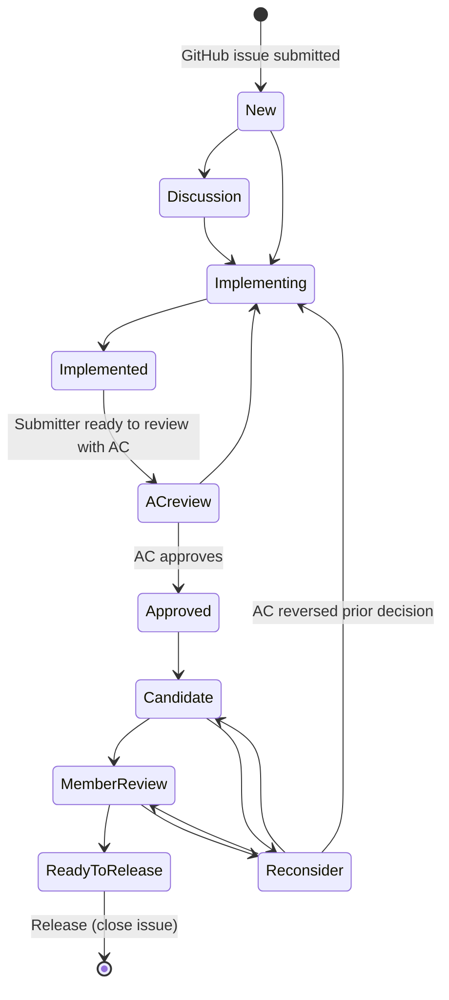

# AgGateway's ADAPT Standard documentation

ADAPT Standard documentation is available at https://adaptstandard.org.

# ADAPT Standard issue management

## Introduction

The purpose of this repository is to store the ADAPT Standard schema and related documentation, as well as to manage ADAPT Standard issues. The ADAPT Standard-related issues are managed in a [GitHub project](https://github.com/ADAPT/Standard/projects/1). Each issue is in a state as specified below.

## Supplementary discussion page

For discussion content that stakeholders feel is not well supported by this repo, consider the following AgGateway Confluence page: [ADAPT Standard changes discussion](https://aggateway.atlassian.net/wiki/x/AwDGxg)

## GitHub Issue state diagram

## Issue states

State | Score CC State | Description
--- | --- | ---
Approved | Draft | An Architecture Committee review team has approved the issue.
AC review | Draft | The submitter has the set of related issues (perhaps only one) ready to review with the ADAPT Committee.
Candidate | Candidate | The components associated with the issue are set to Candidate status in Score.
Discussion | N/A | The submitter would like to discuss the issue with the AC prior to creating/changing components in Score.
Implemented | Draft | The submitter regards that work on components they created/changed in Score is complete and has changed the status in Score to Draft.
Implementing | WIP | The submitter has created/changed components in Score and those changes are in WIP (work-in-progress) status in Score.
Member reveiew | Release | A draft release has been created in Score.
New | N/A | A submitter submitted the issue. The submitter may need to refine the issue content before it’s ready to transition `Discussion` or `Implementing`.
Ready for release | Release | The member review is complete with nothing left to process
Reconsider | Draft or Candidate | A member of the AC believes that, in the interest of ADAPT Standard quality, the issue should be reconsidered.

## Issue transitions

From state | To state | Guard conditions (i.e., what must be true for the transition to occur)
--- | --- | ---
AC review | Approved | <ul><li>AC approves the issue.</li></ul>
AC review | Implementing | <ul><li>AC rejects the issue.</li></ul>
Approved | Candidate | <ul><li>Components associated with the issues have been set to Candidate status in Score.</li></ul>
Candidate | Reconsider | <ul><li>An AC member believes that, in the interest of quality, the issue should be reconsidered.</li></ul>
Discussion | Implementing | <ul><li>Same as `New` to `Implementing`</li></ul>
Implemented | AC review | <ul><li>Submitter is ready to review with AC.</li></ul>
Implementing | Implemented | <ul><li>Submitter regards that work on components they created/changed in Score is complete and has changed the status in Score to Draft.</li></ul>
Member review | Ready for release | <ul><li>Members have validated the release.</li><li>All issues have been processed from the member review.</li></ul>
Member review | Reconsider | <ul><li>Same as `Candidate` to `Reconsider`</li></ul>
New | Discussion | <ul><li>Submitter has determined that he/she wants to discuss the issue (and perhaps related ones) with AC prior to to creating/changing components.</li><li>The submitter has properly formatted the issue</li><ul><li>The title is in the correct format.</li><li>The description in the correct format.</li><li>An appropriate milestone is specified.</li><li>Appropriate labels are set.</ul></ul>
New | Implementing | <ul><li>Submitter has properly formatted the issue (see `New` to `Discussion`)</li><li>Submitter is ready to create / change components in Score and those components are in WIP status in Score.</li></ul>
Ready for release | End | <ul><li>ADAPT Standard is released and the issue is closed and archived.</li></ul>
Reconsider | Implementing | <ul><li>AC reverses its earlier approval.</li></ul>
Start | New | <ul><li>Submitter has an issue to submit.</li></ul>
